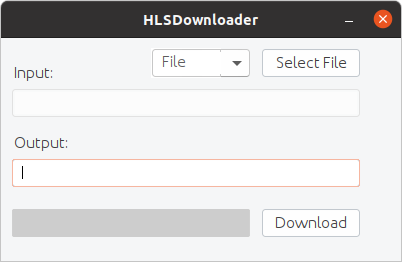
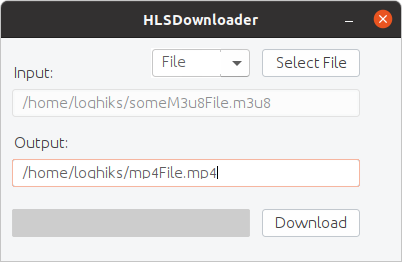
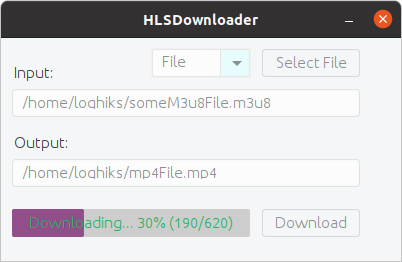

# HLSDownloader
[](LICENSE)

HLSDownloader is a simple tool that allow you to download m3u8 file to mp4.

* [Download](https://github.com/Loghiks/HLSDownloader/releases)

## How to use
* Requirement: Java 8 or above

### GUI mode
First run the .jar file



Next select a file (or url)



Then click on the download button



### CLI mode

Available options:
```
--help              -> Show help menu
--file <file path>  -> Specify the m3u8 file (Can NOT be used with the url option)
--url <url>         -> Specify the the url that points to a m3u8 file (Can NOT be used with the file option)
--out <file path>   -> Specify the output file (.mp4 extension)
--error             -> If an error occurs, it will be printed in a file
```

Example
```bash
java -jar HLSDownloader.jar --file <file path> --out <file path> --error
```
or
```bash
java -jar HLSDownloader.jar --url <url> --out <file path> --error
```

## Build

* Requirement: Maven

`git clone https://github.com/Loghiks/HLSDownloader.git`

`cd HLSDownloader`

`mvn clean package`